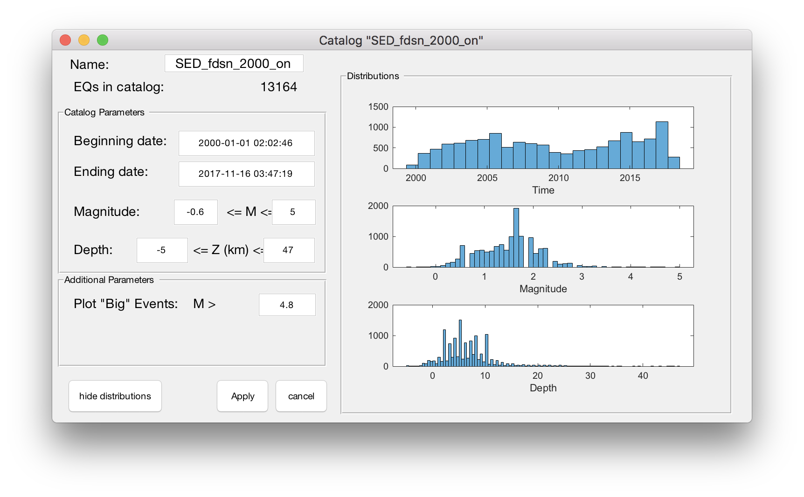
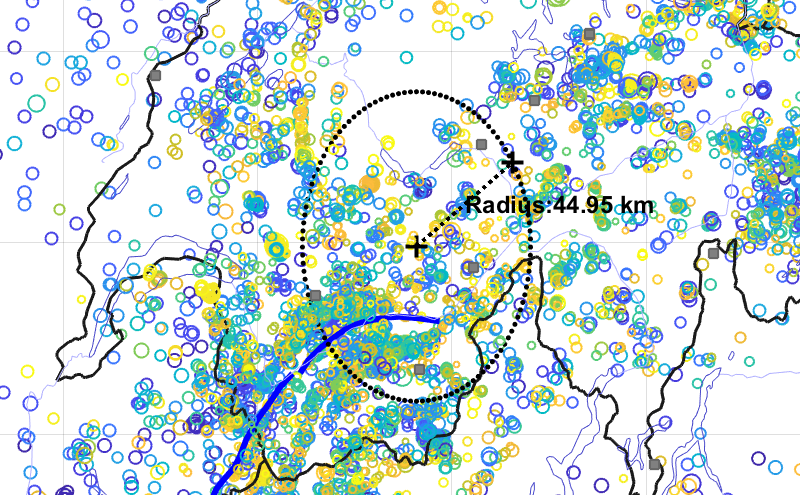
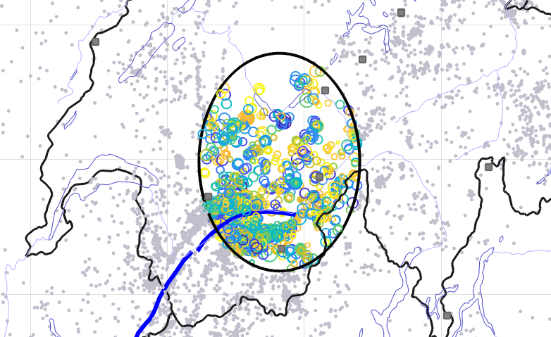

# Zmap version 7.X Readme

## About

ZMAP version7.X represents a major rework of ZMAP.

## Requirements

### ZMAP requires:
- __MATLAB R2018a__ (Version 9.4) or higher
- Mapping Toolbox
- Statistics and Machine Learning Toolbox

### To leverage the parallel computing abilities:
- Parallel Computing Toolbox

### Some functions also require:
- Optimization toolbox.


## Getting Started

### Work flow

#### [How do I ...](docs/HOWDOI.md)
* [subset the catalog?](docs/HOWDOI.md#subset-the-catalog)


### Loading or importing data

From the welcome screen, choose the `data` menu, where you will be presented with several options including:
* `Load Catalog (*.mat file)` : retreive a catalog saved into a matlab data file.  Some sample data can be found in zmap/resrc/sample

* <u>[`FDSN web fetch`](docs/FDSN.md)</u> : retrieve a catalog from an [FDSN web service](https://www.fdsn.org/webservices) 

* `Import Catalog from other formatted file` : this contains functions to import from other sources. these files are _mostly unmaintained_

Catalogs can also be imported from the `Catalog` menu on the main map interface.

Upon importing data you may be presented with another dialog box that allows you to further constrain your data.


Clicking on the `see distributions` button will show a few histograms that may help you decide where to set your parameters


## The Main interfaces

### Main Map Screen

Once a catalog is loaded, you will be presented with the Main Window.

This is where most of the work will happen.  The screen is divided into several sections.  When first presented, all events will be hilighted, and the main map will take up the entirety of the left side of the window.

The plots on the right side of the screen will reflect statistics for the entire catalog.

#### map features

Several features are plotted on the map along with the earthquakes. Which ones are shown can be controlled from the `Map Options` menu.  From here, you an also choose whether to view the map in 3D or toggle its aspect ratio to more-or-less match the geographic region.

### Selecting data of interest

#### Select a region

Regions can be selected in a few ways. Start by right-clicking in the map. Several options related to regions will be presented including :

* `Set Polygon: Box` : select a rectangular region by clicking on two corners to define a box.
* `Set Polygon: Irregular Shape`: select a region by creating a polygon with the mouse.  Anything other than a "normal" click will close the polygon.
* `Set Circle` : Click and drag from the center of the circle out to some radius of interest.
* `Clear Shape` : deletes the shape. all events are once again active.

When any of the above choices have been made, only the events within the region (or _shape_) will be colored. All other events become grey dots.  The plots to the right will also change to reflect your selection.

While defining a circle, you'll see the radius.  This circle is an oval because the map is distorted at this latitude.


Once a shape is defined, then all other events fade into the background.


#### Working with a region

Regions can be modified : scaled, dragged, points added, etc. by right-clicking on the shape itself.  Here are a list of current options (as of Feb 2017):

* `info...` provide basic information about this region and the shape that defines it.

* `Analyze EQ inside Shape`,  `Analyze EQ outside Shape`, and 
`Compare Inside vs Outside` : all bring up a cumulative time plot window, from
where further analysis is possible.

* `edit shape` : activates the shape, allowing it to be dragged, resized (via scrollwheel), and, for some shapes, have individual points added, moved, or removed.
Once you are done with the shape manipulations, select `Finished` from the same context menu. The changes will then be reflected in all the accompanying plots.

* additional options may appear, depending upon the chosen shape. For example,
a *circle* has:
  * `Choose Radius` : allowing you to define a specific radius by typing.
  * `Snap to N Events` : resizes the circle to encompass a specified number of events.

### Cross Sections

#### Selecting cross sections

One or more cross sections can be created. Cross sections are defined along
great-circle arcs, and therefore may not appear as straight lines on the map.
To create a cross section, choose `Define X-section` from the map's context menu (that is, right click on the map). A dialog box will appear to allow the user to choose a width, specify cross-section labels, or override the color. Simple Labels are automatically generated.


The primary map will then shrink to accomodate a cross-section plot that will
appear beneath the map.  In the above image, two cross sections were already made, and the third `C-C'` is in progress.

Notice, information about these cross sections appear on the plots to the right, with colors that match the cross section.

#### Interacting with cross sections

Both the tabs and the cross-section plots are fully interactive.
Clicking on the tab for a cross-section provides the opportunity to see information about the cross section, or to change its width and color.
The option `Examine this area` will change the shape to encompass the cross section.  Deleting the cross section from this menu will also remove it from the map.

Right-Clicking on the axes labels will allow the axes to be changed to any of the available data fields associated with a catalog.  Additionally, Right-clicking on the data will allow you to change the coloring and size schemes.

### Histogram Plots

The binning for these plots can be changed through the axes' context menu.

* `FMD` : frequency magnitude distribution plot. Information contained in here can be further analyzed via the context menu.

### Cummulative plots

* `Cumplot` : show cumulative event count through time
* `Moment` : show cumulative moment through time
* `Time-Mag` : plot of magnitudes through time. (does not reflect cross-sections)
* `Time-Depth` : plot of depths through time (does not reflect cross-sections)

These plots can all be opened in another window, available for further analysis. To do so, right click on the data line of interest.  Additionally, the axes scaling for many plots can be toggled between linear and logarithmic.

# Other stuff

## Concepts

### Object Oriented design

Internally, Zmap has changed from a collection of scripts to
functions and classes.  Here, super briefly, is what these changes mean:

* __functions__ vs __scripts__:
  * _scripts_ work on variables in the main workspace.  Everything one does may
  affect (intentionally or not) values used by other scripts.  Once the script
  is run, then the workspace is left in an altered state.  _every script behaves
  as though the user was typing at the MATLAB command prompt_
  * _functions_ are routines that are self contained. They may take a list of
  arguments (input variables), create and modify a bunch of variables internally, and then return one or more results.  The behavior is well defined at the top
  of each function
* __classes__ : a class is a package of interrelated _functions_ (called _methods_)and _variables_ (called _properties_).  A good class will either represent one
thing, or accomplish one major goal. The use of classes makes ZMAP more stable and consistent.

### major classes

One can get more information about each class through the matlab help
system.  Using one of the help functions, such as  `help`, `doc`, `methods`

For example:

```matlab
>> doc ZmapCatalog
```

This brings up an interactive browser where you can look at the classes'
properties (variables) and methods (functions).

#### ZmapCatalog

The earthquake catalog is now stored in a class, isntead of as an array.  This allows it to be used more intuitively, and provides the ability to store more complex information than numbers.  Some notable details:

* The event time (`Date`) is stored as a `datetime` variable, instead of decimal date. This provides greater precision and accuracy, and comes with some useful functionality.

* The magnitude type (`MagnitudeType`) is now included in the catalog

* access data by the field name, instead of a column number.  ex.  `mycatalog.Longitude` , `mycatalog.Depth`, etc.

#### ZmapData and ZmapGlobal

These two classes work together as a replacement for the `global` data that was everywhere.

#### ZmapGrid

Many computations are area specific, computed for some region around a grid point.  `ZmapGrid` manages these grid points. Grid points may have constant spacing or follow meridians.

#### MapFeature

MapFeatures are stored in ZmapGlobal.Data.features and can be looked up by name.

```matlab
feat = ZmagGlobal.Data.features('borders');
f
feat.plot(ax);
```

#### ZmapFunction

This is the basis for many functions in Zmap.

#### ZmapGridFunction

Functions that operate on a grid are subclassed from `ZmapGridFunction`.  Additional capabilities are provided by this layer

#### ZmapVGridFunction, ZmapHGridFunction, Zmap3DGridFunction

#### ZmapXSectionCatalog

#### ZmapDialog

#### testing

# modification notes for ZmapInABox

## (Super abbreviated) Summary of major changes from earlier versions of Zmap

* __Scripts are now Functions__: Previously, all routines were scripts that
worked by modifying variables in the general workspace. Some of these were
global.
* __Catalogs are no longer arrays__: Catalogs are now of type `ZmapCatalog`.
  * Catalogs now have named fields, such as _Longitude_, _Latitude_, _Date_,
  _Depth_,and _Magnitude_. This makes working with catalogs more intuitive, so in the code, for example, all depths can be accessed as `catalog.depth` instead of `catalog(:,7)`
  * Catalogs can now hold other types of data, such as `datetime`, `string`, and `cell` arrays as needs dictate.
* __dates__: Zmap now uses `datetime` instead of its older decimalyear format.
  * _decimal year_ would mean that time would compress or extend depending upon
  leap years. The conversions were complicated, and repeated throughout the code.
  * _datetime_ allows the use of more sophisticated (and more importantly,
  matlab-handled) time representations.  The difference between two `datetime`
  values is a `duration` value. These are excellent because units are built-in.
  There is no need to guess whether a value is in years, seconds, etc.
* __workspace variables__: The results of calculations are specifically
written to the workspace, whereas previously every value regardless of significance
was written to the workspace.
* __global variables__: Some values are accessed throughout the Zmap program.
These are all kept in an object (variable) named ZmapGlobals. This:
  * keeps them in a coherently named space,
  * allows the values to be saved together
* __Data import__: imported values will now be of type `ZmapCatalog`.
  * Data can now be imported over the web via FDSN services
* Data export
* __user interface__: the user interfacer has been overhauled in countless
ways.

### eval

eval is (no longer/not) a recommended way to do things. Providing strings to be evaluated is generally considered unsafe, and circumvents the ability for MATLAB to check code.  

### CallBack functions

Most callback functions are implemented as char arrays. Ideally they would be function calls instead.  The complications of determining the context makes editing these somewhat less-than straightforward.

## MATLAB changes

Since the time of ZMAP 6.0, the MATLAB language has changed greatly.  Some functions or options have been deprecated, the graphics system has been overhauled, as have MATLAB's object-oriented capabilities. The mapping toolbox was in its infancy.  Try-Catch was not an option, and function handles were not nearly as efficient as they are these days.
the types `string`, `table`, `datetime`, `duration` did not exist.

## catalog / catalog views

you load data into a `ZmapCatalog`.  This is kept in `ZmapData.primeCatalog` (used to be 'a')
You filter it via `catalog_overview` , which yields `ZmapData.Views.primary` containing a `ZmapCatalogView`.   The `ZmapCatalogView` is the go-between between the catalog and the maps.  Changing the view ranges will leave the primary catalog intact.

A `ZmapCatalogView` can be attached either to a globally accessible `ZmapCatalog` or `ZmapCatalogView`.  

Layers within the plotting map are actually an array of `ZmapCatalogViews`, located in 
`ZmapData.Views.Layers`.  Ranges in these views can be changed, and they will affect
the data being displayed.  I would have liked to use `linkdata` to automatically update
the maps, but it appears to get bogged down very quickly as it is used.

When a polygon is created (circle or other shape), it can be used to further filter the
`ZmapCatalogView`.  the working catalog (either newt2 or newcat, I don't remember which)
is the current polygon applied to `ZmapData.Views.primary`

To get a `ZmapCatalog` from a `ZmapCatalogView` using the `ZmapCatalogView.Catalog` function.

## selections and grids

# other general things to tackle project-wide

* `strread` replace usage with textscan. (97 results, 40 files) [in AddOneFiles] since 2010a
  * ex. [a,b,c]=strread(...) => C= textscan(...); [a,b,c] = deal(C{:}) since 2010a
* `textread` replace with textscan as above, and use fopen/fclose.  (31results, 3 files) since 2010a
* `sprintf` - not necessary for error text (74 results in 14 files)
* `hdf_funs.m` - probably outdated. matlab has built-in version hdfread, hdfinfo
* error and warning message identifiers have changed since 2012b.  info [HERE](http://www.mathworks.com/support/solutions/en/data/1-ERAFNC/?solution=1-ERAFNC) -- see pdf
* `num2str` - for large integers, use int2str(x) instead. (manymany, but probably affects very few)
since 2013a
* `HitTest`, `Selected`, and `SelectionHighlight` properties for several ui components shouldn't be used r2014a

* remove MacMarone - doesn't seem to be used, and is likely an unneeded layer of abstraction.  Also.. requires compilation for system and has large disclaimer on web page (dated 2014).

* consider new storage options where it makes sense:  DateTime, table, timetable, timeseries, tscollection, containers.Map,  duration, categorical arrays (especially DateTime and Catagorical Arrays)

* clearly define how functionality can be added to MapSeis

* investigate required actions (documentation? coding? examples?) to facilitate use of MapSeis / Zmap. How do I add functionality? How do I make a script that leverages this?

* **remember to keep zmap compatible with mapSeis**

# previous authors/contributors

[List of authors/contributors](ZmapContributorList.txt)

# Adding Focal mechanisms

look at:
Focal Mechanisms:
https://ch.mathworks.com/matlabcentral/fileexchange/61227-focalmech-fm--centerx--centery--diam--varargin-

Moment tensors can be retrieved from places like: [ISC comprehensive](http://www.isc.ac.uk/cgi-bin/web-db-v4?event_id=610635717&out_format=IMS1.0&request=COMPREHENSIVE)
and IRIS's [SPUD](http://www.isc.ac.uk/iscbulletin/search/webservices/)

# uncertainties, EVENT data

# completeness maps precalculated on the web

completenessweb.org

## ADDING FUNCTIONALITY

* [Adding Functionality](docs/ADDING_FUNCTIONALITY.md) 

  You can add your own functions to ZMAP to calculate values from the earthquake catalog.